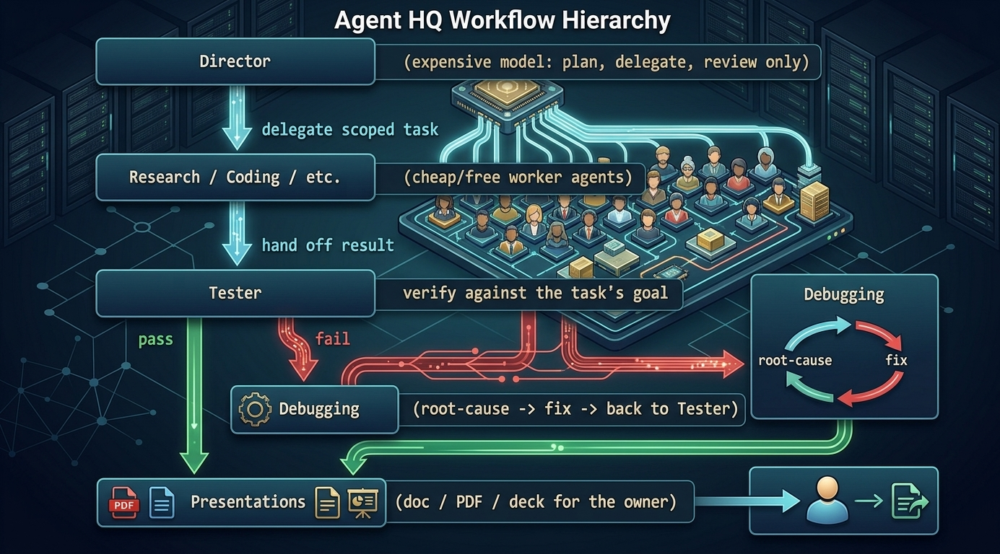

# Agent HQ



A local orchestration layer where one expensive AI model plans and delegates, and a fleet of cheap or free agents does the actual work.

## Why

Strong models (Claude Opus, GPT-5-class models, etc.) are expensive per token, and usage budgets are finite. Most of the tokens burned on a typical coding task aren't spent on hard decisions — they're spent on the mechanical parts: writing boilerplate, reading files, running tests, fixing a typo. Agent HQ separates the two:

- A single **Director** (a strong, expensive model) only plans, delegates, and reviews. It never writes code itself.
- Many **worker agents** (cheaper or free models) do the actual implementation, research, debugging, and testing.

The result: the owner's expensive usage budget is spent almost entirely on judgment calls, not typing. That makes it practical to let the fleet run unattended for hours at a time ("you have 6 hours, finish the project") while still getting a result that has actually been checked, not just generated.

## How it works

1. The **Director** breaks the overall goal down into small, sharply-scoped tasks.
2. Each task is assigned to a worker agent on the **platform** best suited for it (research, coding, debugging, testing, presentation).
3. The **Tester** platform verifies the result of a task against its stated goal.
4. If verification fails, the **Debugging** platform takes over root-cause analysis and hands a fix back into the loop.
5. Every agent ends its work with a short **SUMMARY** that the Director reads and uses to decide the next task.
6. Once the underlying work is done, the **Presentations** platform turns it into a summary/document/deck for the owner.

```
        +-----------------------------+
        |          Director            |  (expensive model: plan, delegate, review only)
        +---------------+---------------+
                        |
                        v  delegate scoped task
        +---------------+---------------+
        |   Research / Coding / etc.    |  (cheap/free worker agents)
        +---------------+---------------+
                        |
                        v  hand off result
        +---------------+---------------+
        |            Tester             |  verify against the task's goal
        +---------------+---------------+
             pass |            | fail
                   |            v
                   |   +--------+--------+
                   |   |     Debugging    |  root-cause -> fix -> back to Tester
                   |   +-----------------+
                   v
        +---------------+---------------+
        |          Presentations        |  doc / PDF / deck for the owner
        +--------------------------------+
```

This loop (delegate -> verify -> debug -> present) repeats task by task until the Director considers the goal met.

## Platforms

| Platform | Purpose |
|---|---|
| Main | Coordination |
| Research | Research and comparisons |
| Coding | Implementation |
| Debugging | Root-cause analysis |
| Tester | Verification of task results |
| Presentations | Documentation, PDFs, presentations for the owner |

## Repo layout

Paths below were confirmed to exist in this repo at the time of writing.

- `server.py` — the Python backend (HTTP server, agent/task state, provider calls)
- `index.html` — the web UI served by the backend
- `data/` — persisted state (`state.json`, `agents.json`, bench results, `notes/`)
- `docs/` — plans, audits, and research write-ups
- `platforms/` — UI variants for individual platforms (currently `coding/`)
- `tools/` — helper scripts, e.g. `md2pdf.py`, `md2pptx.py` for turning Markdown into deliverables
- `tests/` — pytest test suite (`pytest.ini`, `conftest.py`, `test_*.py`)
- `vendor/` — vendored front-end JS dependencies (`three.module.js`, `OrbitControls.js`)
- `uploads/` — server-side chat image uploads
- `workspaces/` — per-agent working directories
- `logs/` — runtime logs
- `.env` / `.env.example` — provider API keys and config (see below)

## Running it

The backend is a single Python 3 script with no external web framework — it uses the standard library's `http.server`.

```
python server.py
```

By default this starts a plain HTTP server at `http://127.0.0.1:8765`. Stop it with Ctrl+C.

Useful flags/env vars (read from `server.py`):

- `--https` — serve over HTTPS instead of plain HTTP (self-signs a local TLS certificate)
- `--certfile` / `--keyfile` — override the TLS cert/key paths used with `--https`
- `AGENT_HQ_PORT` — override the port (default `8765`)
- `AGENT_HQ_DATA_DIR` — override where state is persisted (default `data/` next to `server.py`)

**API keys / config:** copy `.env.example` to `.env` in the repo root and fill in only the provider keys you actually use (`OPENROUTER_API_KEY`, `GEMINI_API_KEY`), plus optional timeout and message-size limits. Never commit your real `.env` file — do not paste real keys into this README or any other tracked file.

## Status

Early stage, actively under development. Backends currently supported: Claude, OpenCode, OpenRouter, Gemini, and Mock (for testing). Expect rough edges, in-progress docs under `docs/`, and structure that will keep shifting as the platform model is fleshed out.
